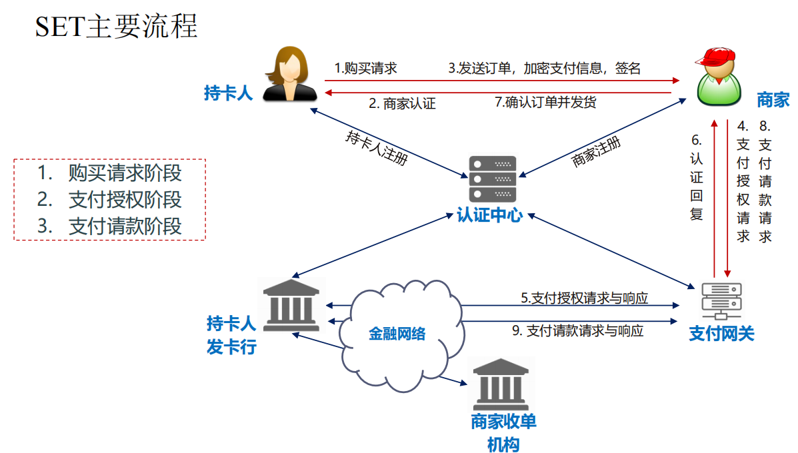

# 基于SET协议的简易电子支付系统
## 项目简介
该项目设计并实现了一个模拟SET（Secure Electronic Transaction）协议的电子交易系统，涵盖证书颁发机构（CA）、持卡人、商家、支付网关和银行五大核心模块。系统通过混合加密机制（RSA+DES）保障交易数据机密性与完整性，支持完整的支付授权、请款与验证流程，适用于高并发电子商务场景下的安全交易需求。

## SET协议流程示意图
该项目实现的简易框架图如下所示：

## 项目结构（点击可查看每个文件）
- [`CA.py`](./CA.py)：作为证书颁发机构，向各个参与方办法可信证书
- [`Bank.py`](./Bank.py)：作为银行参与方
- [`Cardholder.py`](./Cardholder.py)：作为持卡人参与方
- [`Marketer.py`](./Marketer.py)：作为商家参与方
- [`CA.py`](./CA.py)：作为证书颁发机构，向各个参与方办法可信证书
- [`PaymentGateway.py​​`](./PaymentGateway.py​​)：作为支付网关参与方
- [`CapToken.py​​​​`](./CapToken.py​​​​)：安全令牌的生成与验证
- [`DES_ED.py​​​​​​`](./DES_ED.py​​​​​​)：DES加密工具类，实现DES-ECB模式的加解密，并且具备自动数据填充功能（PKCS5）
- [`RSA_sign.py​​`](./RSA_sign.py​​)：RSA签名工具类
- [`payment.bat​​`](./payment.bat​​)：批处理启动脚本，一键启动CA、持卡人、商家、支付网关、银行五个节点

## 部署指南
将项目git到本地之后，可以直接运行批处理启动脚本，即可一键启动各个参与节点。

## 项目演示视频

